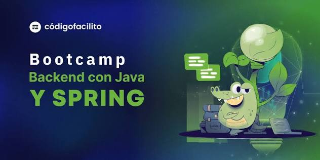

  
  
  
  

# Notas de estudio del Bootcamp de Backend con Java y Spring de Código Facilito (G2)

Apuntes, código y más como complemento al bootcamp.

Por [KrisbelGV](https://github.com/KrisbelGV), con 💚 para la comunidad de Código Facilito

¡Gracias una vez más por esta gran oportunidad!

## Requisitos previos

* Java (intermedio).
* Maven o Gradle.
* Línea de comandos (básico).
* BBDD relacionales y SQL (básico).

[Ruta de nivelación](https://codigofacilito.com/rutas/introduccion-backend-java-spring) desbloqueada por CF para inscritos al bootcamp.

## Licencia y condiciones

Compartido por una estudiante para uso personal y de aprendizaje, __DERECHOS RESERVADOS A CÓDIGO FACILITO EN TODO EL MATERIAL PROTEGIDO POR COPYRIGHT DE SU AUTORÍA__. Presto a su completa disposición lo que de mi parte añada, entre tanto cubierto bajo la licencia [CC BY-SA 4.0](LICENSE).

Para sugerencias y corrección de errores no dudes en contactarme ya sea mediante un issue u a través del canal oficial en Telegram.