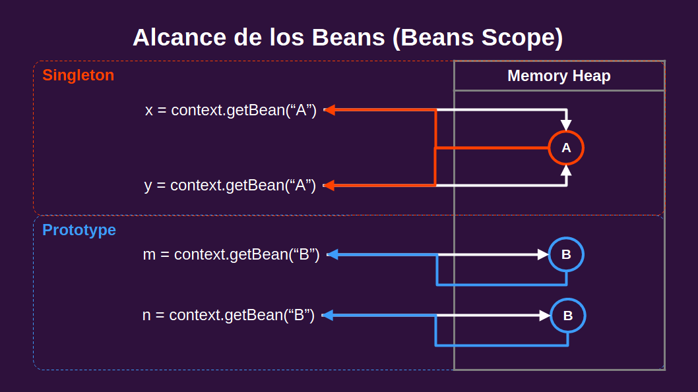

# Clase 3: Introducción a Spring Framework y Contenedor de Inversión de Control, Parte 2

## Configuración por metadatos
```XML
<beans xmlns="http://www.springframework.org/schema/beans"
       xmlns:xsi="http://www.w3.org/2001/XMLSchema-instance"
       xsi:schemaLocation="http://www.springframework.org/schema/beans
                           http://www.springframework.org/schema/beans/spring-beans.xsd">

    <bean id="bean" class="dependencia">
        <property name="atributo1" value="valor1"/>
        <property name="atributo2" value="valor2"/>
        …
        <property name="atributoN" value="valorN"/>
    </bean>

    <bean id="bean" class="dependencia">
        <constructor-arg ref="beanDependiente"/>
    </bean>
</beans>
```

## Gestionar múltiples configuraciones
En un ApplicationContext constituido por múltiples clases de configuración a través del uso de @Import.

```java
@Configuration
@Import({Config1.class, Config2.class... ConfigN.class})
public class ApplicationConfig {
} 
@Configuration
public class Config1 {
  @Bean
  public Interfaz bean(tipoDependencia dependencia) {
    return new Clase(dependencia);
  }
}
@Configuration
public class Config2 {
  @Bean
  public Interfaz bean(tipoDependencia dependencia) {
    return new Clase(dependencia);
  }
}

@Configuration
public class ConfigN {
  @Bean
  public Interfaz bean(tipoDependencia dependencia) {
    return new Clase(dependencia);
  }
}
```

## Alcance de los Beans (Beans Scope).
* Singleton: Instancia única, la cual retornará el contenedor siempre que se lo solicite. Usado en Stateless/immutable beans, o servicios compartidos. Es el ámbito por defecto.
* Prototype: Nueva instancia por cada solicitud. Empleado en Stateful beans, sujetos a ambientes concurrentes.

> Desarrollado por el tutor en clase, la imagen es una recreación de la alumna.



## Propiedades externas 
Cargadas del runtime en el bean Environment.
* application.properties:
```properties
modulo.propiedad1=valor1
modulo.propiedad2=valor2
modulo.propiedadN=valorN
```
* Configuration class:
```java
@Configuration
public class Config {
    @Bean
    public Interfaz bean(Environment env) {    
        // Obtenemos los valores con env.getProperty("modulo.propiedad"));
        ...
    }
}
```

## Perfiles de Spring
Representan ambientes o bibliotecas, agrupan beans permitiendo un control granular.
```java
@Configuration
public class ApplicationConfig{
  @Bean
  @Profile("perfil")
  public Interfaz bean(){
    return new Clase(dependencia());
  }
}
```
Activación:
```bash
-Dspring.profiles.active=perfil
```

## Spring Expression Language (SPEL)
Características para evaluar dinámicamente expresiones simples o complejas, acceder a propiedades, beans, invocar métodos, entre otros.

## Configuración basada en anotaciones
Su forma implícita. El escáner se encarga de buscar las clases y crear los Beans.
```java
@Component
public class Clase implements Interfaz {
    private Interfaz dependencia;
    public Clase(Interfaz dependencia) {
        this.dependencia = dependencia;
    }
}
```
```java
@Configuration
@ComponentScan("com.paquete.base")
public class Config {
    // La definición de Beans ya no es necesaria
}
```

## Inicio y apagado (Startup and Shutdown)
Añade comportamiento a un Bean cuando es creado o inicializado.
```java
@Component
public class Clase implements Interfaz {
    @PostConstruct
    public void Metodo() {
        …
    }

    @PreDestroy
    public void Metodo() {
        …
    }
}
```

## Estereotipos
Indicadores de un uso específico para clases anotadas mediante el escáner, todas especializaciones de @Component (@Service, @Controller, @Configuration, etc).

## Meta anotaciones
Permite la personalización al combinar varias anotaciones en una sola.